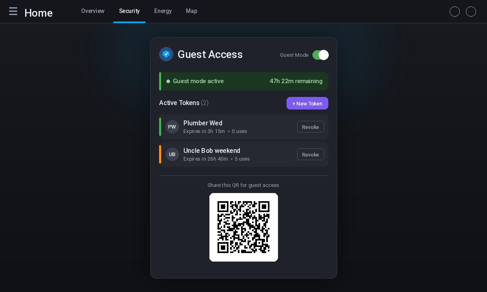

<p align="center">
  
</p>

<h1 align="center">Gatekeeper HA</h1>

<p align="center"><strong>QR-code-based temporary guest access for Home Assistant.</strong></p>

|A native custom integration + Lovelace card that lets you generate time-limited, scoped guest tokens and serve them via a standalone guest page — no app install required. The [Lovelace card lives in its own repo](https://github.com/rusty4444/gatekeeper-card).

## Features

- **🔑 Scoped guest tokens** — generate time-limited URLs that grant access only to specific entities, domains, and services
- **📱 Standalone guest page** — guests just scan a QR code or open a link. No HA login, no app install
- **⏱️ Auto-expiry** — tokens expire after a configured duration. Use limits also supported
- **🛡️ Guest mode** — toggle a full guest mode that disables selected automations and revokes all tokens on exit
- **📋 Admin Lovelace card** — create/revoke tokens, see remaining time, display QR code, toggle guest mode — all from a card on your dashboard
- **🧩 Automation blueprints** — shipped with doorbell → auto-token, token expiry alert, and lock-code → guest mode blueprints
- **⚙️ Fully UI-configurable** — set up via Settings → Devices & Services, no YAML editing

## Preview



## Quick Start

### 1. Install via HACS

Gatekeeper HA is not yet in the default HACS store. For now:

1. Add as a **Custom Repository** in HACS:
   - URL: `https://github.com/rusty4444/gatekeeper-ha`
   - Category: Integration
2. Download the integration
3. Restart Home Assistant

### 2. Install the Lovelace Card

The [Gatekeeper Guest Portal card](https://github.com/rusty4444/gatekeeper-card) is distributed from its own repository, with independent versioning and releases.

1. Go to HACS → Frontend → Custom Repositories
2. Add: `https://github.com/rusty4444/gatekeeper-card`
3. Category: Lovelace
4. Search for **Gatekeeper Guest Portal** and install
5. Add the resource: `/hacsfiles/gatekeeper-card/gatekeeper-card.js` (Type: JavaScript Module)
6. Add card to any dashboard: `type: custom:gatekeeper-card`

For full card documentation, see the [gatekeeper-card repo](https://github.com/rusty4444/gatekeeper-card).

### 3. Configure

1. Go to **Settings → Devices & Services → Add Integration**
2. Search for "Gatekeeper HA"
3. Configure the guest page port (default: 8921) and default token expiry
4. The card will appear in your Lovelace card picker

### 4. Share access

1. From the Gatekeeper card, tap **+ New Token**
2. Set a label (e.g. "Plumber Wednesday"), scope (e.g. `lock.*`, `light.*`), and duration
3. The card shows a QR code — screenshot it, or copy the guest URL
4. Guest opens the link and gets a simple page with the controls you allowed

## Configuration

All configuration is via the UI. Go to **Settings → Devices & Services → Gatekeeper HA → Configure**.

| Option | Default | Description |
|--------|---------|-------------|
| Guest page port | 8921 | Port for the standalone guest web page |
| Default token expiry | 24h | Default hours for new guest tokens |
| Auto-disable after | 48h | Auto-disable guest mode after N hours (0 = manual) |

## Blueprints

Three automation blueprints are bundled in `/blueprints/`:

| Blueprint | What it does |
|-----------|-------------|
| `guest_arrived.yaml` | Someone rings the doorbell → auto-creates a 4-hour token, sends it to your phone |
| `token_expiry_alert.yaml` | Every 15 minutes checks if any token is near expiry → sends alert |
| `guest_mode_lock.yaml` | Guest enters a specific lock code → activates guest mode with auto-disable |

## Architecture

```
Custom integration (custom_components/gatekeeper/)
├── token_manager.py      # Token CRUD, bcrypt hashing, expiry engine
├── guest_mode.py         # State machine, automation snapshot/restore
├── auth_proxy.py         # Standalone asyncio HTTP server (guest page + proxy)
├── config_flow.py        # Full UI-based setup
├── services.yaml         # 6 HA services (create/revoke token, activate/deactivate mode, etc.)
└── ...

<<<<<<< HEAD
Lovelace card — see [rusty4444/gatekeeper-card](https://github.com/rusty4444/gatekeeper-card)
=======
Lovelace card (separate repo: https://github.com/rusty4444/gatekeeper-card)
>>>>>>> 9c197b6 (Update README to point to separate gatekeeper-card repo)
├── src/index.js          # LitElement card — admin panel, QR display, token management
└── ...

Blueprints (blueprints/)
├── guest_arrived.yaml
├── token_expiry_alert.yaml
└── guest_mode_lock.yaml
```

## Security

- Guest tokens never expose the raw secret in logs (hashed with bcrypt)
- The guest page runs on a separate port (configurable, defaults to 8921)
- All scope enforcement happens server-side — the guest's JS never overrides permissions
- Token IDs are generated with `secrets.token_urlsafe(32)`
- Tokens can be use-limited (N API calls) in addition to time-limited
- Guest mode snapshots automations on activate and restores them on deactivate

## Guest Proxy & Reverse Proxy

The guest page is served by a lightweight HTTP server embedded in the integration, bound to `0.0.0.0:8921` by default (reachable from any device on your LAN). This is required for the QR-code flow — guests scan the code from their phone.

**If you run HA behind a reverse proxy** (Nginx, Caddy, Traefik, etc.) and only want the guest page accessible through that proxy:

1. Set the guest port to a high local-only port (e.g. 58921) in **Settings → Devices & Services → Gatekeeper HA → Configure**
2. Add a location block in your proxy config pointing to `http://127.0.0.1:58921`
3. Restrict with your proxy's usual auth / IP allowlist rules

The bind host can also be changed to `127.0.0.1` via [the options flow](#configuration) if you do not want it exposed on the LAN directly.

## Development

```bash
# Clone
git clone https://github.com/rusty4444/gatekeeper-ha
cd gatekeeper-ha

# Install test deps
pip install -r requirements-dev.txt

# Run tests
pytest tests/

<<<<<<< HEAD
# Build Lovelace card (in its own repo)
# git clone https://github.com/rusty4444/gatekeeper-card
# cd gatekeeper-card && npm install && npm run build
=======
# Build Lovelace card (separate repo: https://github.com/rusty4444/gatekeeper-card)
git clone https://github.com/rusty4444/gatekeeper-card
cd gatekeeper-card && npm install && npm run build
>>>>>>> 9c197b6 (Update README to point to separate gatekeeper-card repo)
```

## Requirements

- Home Assistant 2025.8.0+
- Python 3.12+

This project was developed with the assistance of AI tools.

## License

MIT
